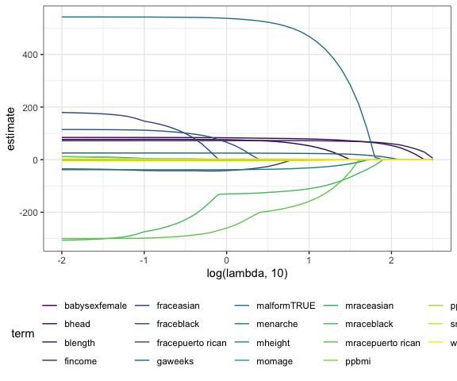
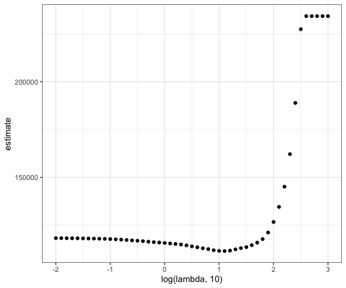

Statistical Learning
================
Derek Lamb
2023-12-07

### Load packages

``` r
# Load packages
library(tidyverse)
library(glmnet)

# Set default figure options
knitr::opts_chunk$set(
  fig.width = 6,
  out.width = "90%"
)

theme_set(theme_bw() + theme(legend.position = "bottom"))

options(
  ggplot2.continuous.colour = "viridis",
  ggplot2.continuous.fill = "viridis"
)

scale_colour_discrete = scale_colour_viridis_d
scale_fill_discrete = scale_fill_viridis_d

set.seed(11)
```

``` r
df_bwt <- 
  read_csv("data/birthweight.csv") |> 
  janitor::clean_names() |>
  mutate(
    babysex = as.factor(babysex),
    babysex = fct_recode(babysex, "male" = "1", "female" = "2"),
    frace = as.factor(frace),
    frace = fct_recode(
      frace, "white" = "1", "black" = "2", "asian" = "3", 
      "puerto rican" = "4", "other" = "8"),
    malform = as.logical(malform),
    mrace = as.factor(mrace),
    mrace = fct_recode(
      mrace, "white" = "1", "black" = "2", "asian" = "3", 
      "puerto rican" = "4")) |> 
  sample_n(200)
```

    ## Rows: 4342 Columns: 20
    ## ── Column specification ────────────────────────────────────────────────────────
    ## Delimiter: ","
    ## dbl (20): babysex, bhead, blength, bwt, delwt, fincome, frace, gaweeks, malf...
    ## 
    ## ℹ Use `spec()` to retrieve the full column specification for this data.
    ## ℹ Specify the column types or set `show_col_types = FALSE` to quiet this message.

Get predictors and outcome

``` r
x = model.matrix(bwt ~ ., data = df_bwt)[, -1]

y = df_bwt |> pull(bwt)
```

``` r
lambda = 10^(seq(3, -2, -0.1))

lasso_fit = 
  glmnet(x, y, lambda = lambda)

lasso_cv =
  cv.glmnet(x, y, lambda = lambda)

lambda_opt = lasso_cv$lambda.min
```

let’s look at lasso results

``` r
lasso_fit |> 
  broom::tidy() |> 
  filter(term != "(Intercept)") |> 
  select(term, lambda, estimate) |> 
  complete(term, lambda, fill = list(estimate = 0)) |> 
  ggplot(aes(x = log(lambda, 10), y = estimate, color = term, group = term)) +
  geom_path()
```



``` r
lasso_fit |> 
  broom::tidy() |> 
  filter(term != "(Intercept)") |> 
  filter(step == 20)
```

    ## # A tibble: 11 × 5
    ##    term               step estimate lambda dev.ratio
    ##    <chr>             <dbl>    <dbl>  <dbl>     <dbl>
    ##  1 babysexfemale        20   46.2     12.6     0.627
    ##  2 bhead                20   77.9     12.6     0.627
    ##  3 blength              20   71.8     12.6     0.627
    ##  4 fincome              20    0.253   12.6     0.627
    ##  5 gaweeks              20   23.1     12.6     0.627
    ##  6 malformTRUE          20  447.      12.6     0.627
    ##  7 menarche             20  -29.4     12.6     0.627
    ##  8 mraceblack           20 -105.      12.6     0.627
    ##  9 mracepuerto rican    20 -145.      12.6     0.627
    ## 10 smoken               20   -2.62    12.6     0.627
    ## 11 wtgain               20    2.32    12.6     0.627

``` r
lasso_cv |> 
  broom::tidy() |> 
  ggplot(aes(x = log(lambda, 10), y = estimate)) +
  geom_point()
```


